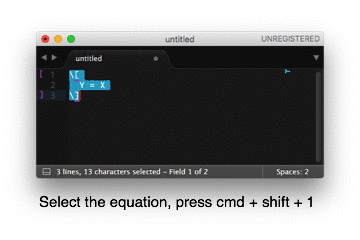

LaTeX Snippets for Sublime Text
===============================

Introduction
------------

Feel free to add your own snippets and send a pull request.

As LaTeX is, in Sublime's interpretation, rather text than code, one has to trigger auto-completion manually when typing. Alternatively, change the auto-completion mode in order to make the menu show when typing.

Numbered/Unnumbered Equations
-----------------------------

Suppose you have written an unnumbered equation.

```
\[
  Y = X.
\]
```
 
Later, you want to change it to a numbered one or vice versa.

```
\begin{equation}
  Y = X.
\end{equation}
```

To use them, first save these two snippets, and second define key bindings to implement them. For example, let `Packages/User/My Snippets/LaTeX/turn_on_number.sublime-snippet` be path of the first snippet. One can define `cmd + shift + 1` and `cmd + shift + 0` (on Mac OS) as the shortcut for turning the equation number on and off by adding the following to your sublime text key bindings.

```
{
    "keys": ["super+shift+1"],
    "command": "insert_snippet", 
    "args": { "name": "Packages/User/My Snippets/LaTeX/turn_on_number.sublime-snippet"}
},
{
    "keys": ["super+shift+0"],
    "command": "insert_snippet", 
    "args": { "name": "Packages/User/My Snippets/LaTeX/turn_off_number.sublime-snippet"}
},
```


